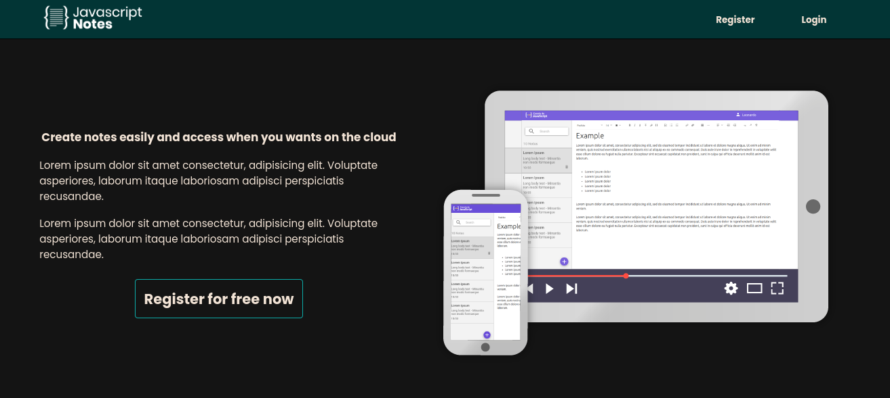
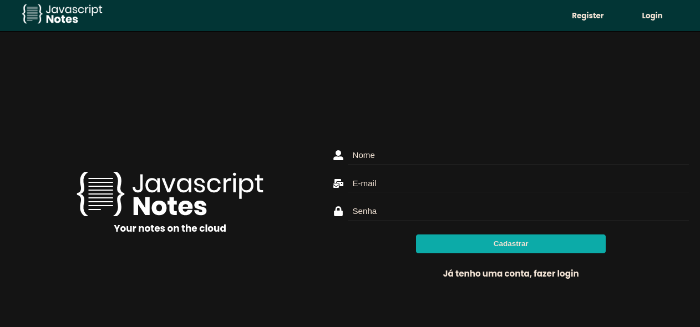
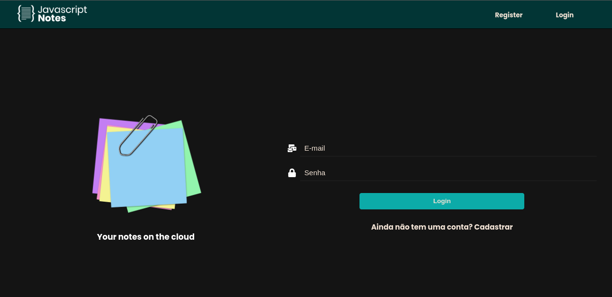
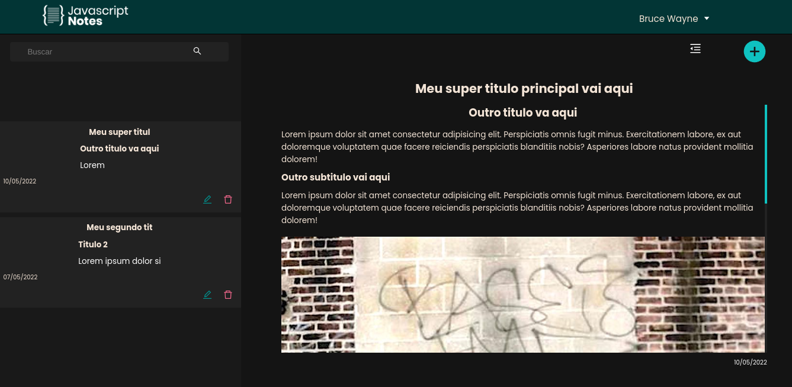

<h1 align="center">
   MyEvernote
</h1>

# MyEvernote
MyEvernote is an app to write down your ideas anytime

# Screens






## Technologies used
  - [ViteJS](https://vitejs.dev)
  - [Typescript](https://www.typescriptlang.org)
  - [Sass](https://sass-lang.com)
  - [React Toastify](https://npm.io/package/react-toastify)

## Requirements

You need to install both [Node.js](https://nodejs.org) and [Yarn](https://yarnpkg.com) or npm to run this project.

## How to use it

```bash
  # Install the dependencies
  $ yarn install
  # Run the web server
  $ yarn dev
```

The app will be available for access on your browser at (http://localhost:3000)
